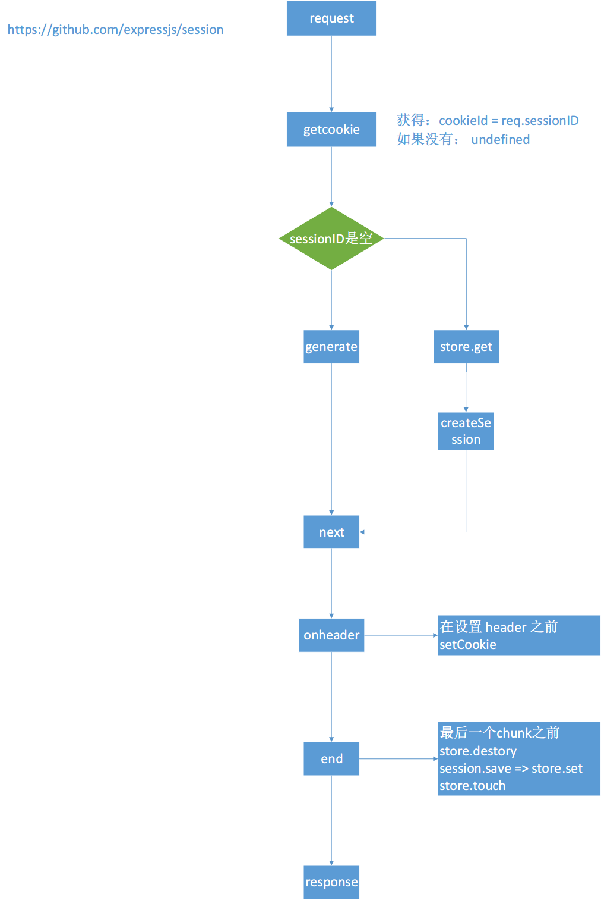

# nodejs模块学习： express-session 解析

nodejs 发展很快，从 npm 上面的包托管数量就可以看出来。不过从另一方面来看，也是反映了 nodejs 的基础不稳固，需要开发者创造大量的轮子来解决现实的问题。

知其然，并知其所以然这是程序员的天性。所以把常用的模块拿出来看看，看看高手怎么写的，学习其想法，让自己的技术能更近一步。

## 引言

最近 ‘双十一‘ 快到了，领导安排我们给网站做性能优化。其中最要的方向是保证网站的稳定性。我主要是负责用户登录入口这一块的工作。

优化的目标是：在高峰下，如果系统服务器端 session 的存储（memcached）出现了问题，用户还能正常登录和使用我们的网站。

并已经给出了技术思路：对 session, 进行服务器端 session(memcached) 和 浏览器端 session（cookie） 双备份，一但连接发现服务器端 session 出现了问题，就启用浏览器端 session, 实现自动降级处理。

借此机会，正好比较深入的了解了一下 session 等相关知识实现。

## session

### session 是什么

注意这里说的都是网站相关技术环境下。

session 是一种标识对话的技术说法。通过 session ，我们能快速识别用户的信息，针对用户提供不一样的信息。

session 的技术实现上：会对一次对话产生一个唯一的标识进行标识。

### session 生命周期

session 标识产生的时机和清除时机:

1. 用户已经登录：这个唯一标识会在用户登录时产生，用户点击退出时或者关闭浏览器时清除。
2. 用户未登录： 这个唯一标识会用用户进入网站时产生，用户关闭所有网站相关页面时清除。

session 生命周期： 在生成和清除之间，在网站内的页面任意跳转，session 标识不会发生变化。

从 session 开始到清除，我们叫一次会话，也就是生成 session。

### session 特点

每次对话， session 的 id 是不一样的。

session id 需要每次请求都由客户端带过来，用来标识本次会话。这样就要求客户端有能用保存的 sesssionId。

### session 技术方案

当前业界通用的方案是：cookie 。当然还有无 cookie 的方案，对每个链接都加上 sessionId 参数。

### session 使用流程

1. 用户登录后，将 sessionId 存到 cookie 中。
2. 用户在请求的网站别的服务时，由浏览器请求带上 cookie，发送到服务器。
3. 服务器拿到 sessionId 后，通过该 Id 找到保存到在服务器的用户信息。
2. 然后再跟据用户信息，进行相应的处理。

从流程有几个点要关注：
1. 什么时候根据 sessionId 去拿 session
2. 确保 session 可用性

下面就结合 express-session 来讲讲具体 session 的实现。

## express-session 的分析
主要关注问题：

1. 怎样产生 session
2. 怎样去拿到 session
3. 怎样去保存 session
4. 怎样去清除 session

### express-session 位置


这一一张更详细的 session 流程图，同时也说明了 express-session 的基本的工作模块。

express-session 有四个部分：

1. request, response 与 session 的交互的部分
2. session 数据结构
3. session 中数据存储的接口 store
4. store 默认实现 memory(cookie 实现已被废)



这张是 express-session 的流程图，从图中可以看到， express-session 的工作流程。

具体的情况只能去看代码了。

因为我们的网站是 session store 是基于 memcached 的。所以我把 connect-memcached 和 memcached 都看了一遍。

connect-memcached 是基于 memcached 实现 session store 接口。

memcached 是基于连接池的应用，下面是我画的结构图：


## 问题解决方案

上面把 session 和 express-session + connect-memcached 都仔细看过了。

回到前面引言中的方案，我们需要解决以下的问题：

1. 基于 memcached 的 session 怎么把数据同步到基于 cookie 的 session 中。
2. 怎么把 cookie　的　session 数据恢复到　session 中。
3. 怎样判断 memcached 已经失去连接。

解决1，2两个问题，可以让用户在一次对话中，在 mecached 和 cookie 中切换，数据还一直存在，不会丢掉。

第3个问题，就是在 memcached 断开时，程序能知道 memcached 已断，然后数据从 cookie 中拿。

### 库选择
已经有 express-session 的方案，要有一个在客户端找一个基于 cookie 的 session 方案：[cookie-session](https://github.com/expressjs/cookie-session) 和 [client-session](https://www.npmjs.com/package/client-sessions) 这两个都可以。我选了第二个，主要是加密第二个更好。

### 方案
我前前后后，考虑了多个方案，方案如下：


首先方案一：主要思路是通过一个基础的监控程序去按时间定时(比如5分钟)去ping memcached 服务器，去判断是否可用，然后把结果写入到 zookeeper 中，通过 zookeeper 的变量去控制数据从 memcached 的session 中读取，还是从 cookie session 中读数据。

方案二：在两个 session 之上，再建一个 session，就是对从哪里读数据通过这个 session 来实现，也就是代理模式。

方案三：在 store 层上做一层 common-store , 然后由他负责从哪个store 中读取数据，就是　store 的代理。

方案四：不做中间层，直接使用进行处理，只用 express-session 进行处理数据。

这四个方案都在选择，区别只是实现上的难度：

1. memcached 的不可连接是否可以在框架层感知道
2. 业务代码尽量不用调整
3. session 同步方案是否有效

其中第一个问题最重要，如果框架层不可感知，那就要有一个外部程序进行处理，或者写一个中间件去主动连接一下，看看是否可连接。

再一次阅读 express-session 重点查看 session 中 store 连接这块。发现如果 memcached 不可连接，req.session 是 undefined 的。

这样，就可以通过判断 req.session 是否是直来判断是否可连接。

第二个问题：因为业务代码中使用都是 req.session 的形式， 从 cookie 中恢复数据的时候，就要成初始化成 express-session 的接口。

这个问题也通过阅读代码解决：

```js
  req.sessionID = uuid.v4();
  req.session = new expresssession.Session(req, data);
  req.session.cookie = new memcachedSession.Cookie({
    domain: config.cookieDomain,
    httpOnly: false
  });
```

通过以上的代码就可以从数据中恢复 session。

第三个问题： 要保证 session 一致，就让数据指向同一个对象

```js
req.session2.sessionBack = req.session;
```

因此方案1，方案2， 方案3 都扔掉，直接方案4。

完整的代码如下：

```js
const config = global.config;
const session = require('express-session');

/**
 * 该中间件主要把 express-session 和 client-session 集中起来处理，如果 memcached 出错了，使用 cookie session
 * @param backSession cookeSession 的键名
 * @returns {function(*=, *=, *)}
 */
module.exports = (backSession) => {
    return (req, res, next) => {
        let notUseMemcached = _.get(req.app.locals.pc, 'session.removeMemcached', false);

        if (req.session && !notUseMemcached) {  // memcached 可用
            req.memcachedSessionError = false;
        } else {  // memcached 不可用
            // 重建 session
            res.emit('sessionError');
            req.memcachedSessionError = true;
            req.session = new session.Session(req);
            req.session.cookie = new session.Cookie({
                domain: config.cookieDomain,
                httpOnly: false
            });

            req.session = Object.assign(req.session, req[backSession].sessionBack);
        }

        Object.defineProperty(req.session, 'reset', {
            configurable: true,
            enumerable: false,
            value: function() {
                req.session.destory();
                req[backSession].reset();
            },
            writable: false
        });

        // 备份数据
        req[backSession].sessionBack = req.session;

        next();
    };
};
```

这里就不贴 express-session 和 client-session 初始化代码，需要注意的是：这个中间件要放到初始化的后面。

```js
 app.use(memcachedSession({
    // ... options
    }));

    app.use(cookieSession({
    // ... options
    }));

    app.use(yohoSession({
        backSession: 'session2'
    }));
```

## 总结

网站稳定性一直是一个重要的话题。这次通过 session 的改造，让我复习了很多的知识，学无止尽。


